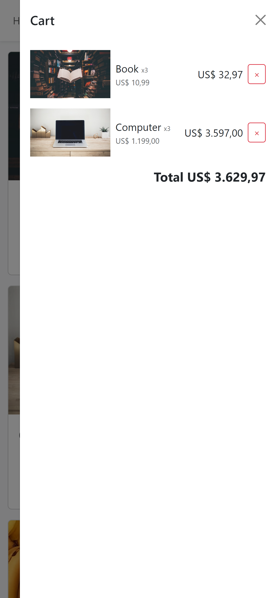

# Shopping Cart Project

## Description

This is a shopping cart project developed with React and TypeScript, utilizing React-Bootstrap for styling. The goal is to create a functional application where users can add and remove items from the cart, leveraging the use of the useContext hook to manage the application's global state.

## Technologies

- React
- TypeScript
- React-Bootstrap
- Bootstrap

## Objective

The objective of this project is to develop an interactive shopping cart that allows users to intuitively add and remove items. Additionally, it aims to enhance skills in using the aforementioned technologies, applying modern architecture and best development practices.

## Motivation

This project was created as a learning endeavor, intended to explore and deepen knowledge in front-end technologies such as React and TypeScript, and in integrating component libraries like React-Bootstrap.

## Features

- Add items to the cart
- Remove items from the cart
- View items in the cart
- Responsive support for mobile devices

## Screenshots

### Desktop

### Mobile

